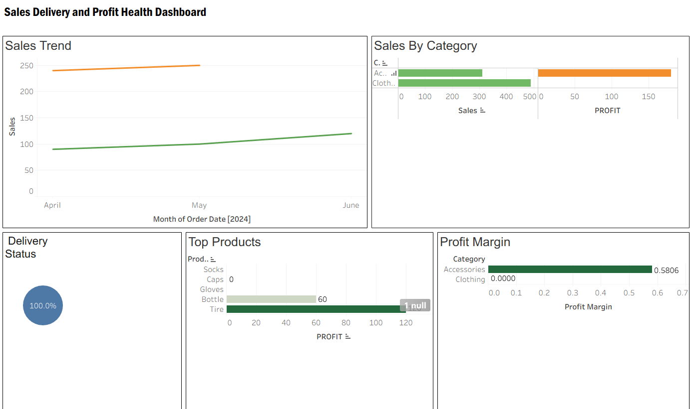

# Sales Delivery and Profit Health Dashboard

## Business Question
Are we shipping fast enough — and are we making money when we do?

## Dataset
5 CSV files: Orders, OrdersArchive, Customers, Products, Employees
Combined using Union + 3 Joins

## Skills Used
- Data modelling: Union + Joins across 5 files
- Calculated fields: Profit, Profit Margin %, Days to Ship, Delivery Status
- Reference lines, color formatting, interactive filters
- Tableau Public dashboard with 6 charts

## Live Dashboard
[Click here to view](https://public.tableau.com/app/profile/samarpit.jain/viz/SalesDeliveryandProfitHealthDashboard/Dashboard1)

